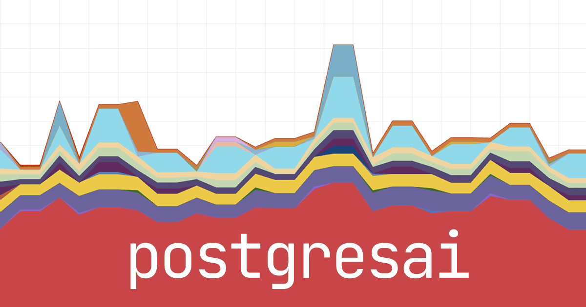
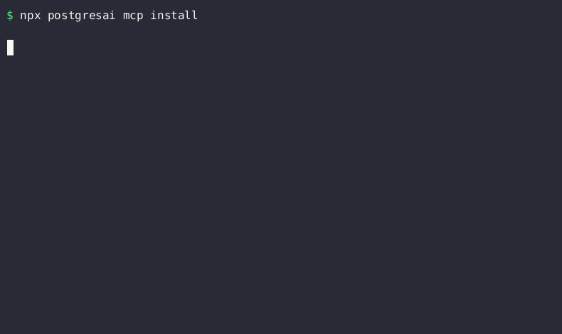
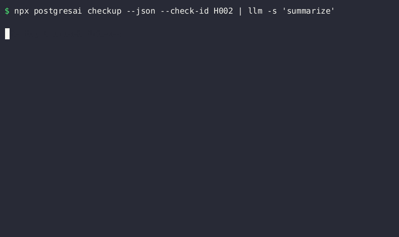

<div align="center">

# postgresai

### AI-native PostgreSQL observability

[](https://www.npmjs.com/package/postgresai)
[](LICENSE)
[](https://postgresql.org)
[](https://gitlab.com/postgres-ai/postgresai/-/pipelines)
[](https://gitlab.com/postgres-ai/postgresai/-/pipelines)

**Monitoring, health checks, and root cause analysis — built for humans and AI agents**

[Live Demo](https://demo.postgres.ai) ·
[Documentation](https://postgres.ai/docs) ·
[Get Started](#get-started)

</div>

<div align="center">

</div>


Battle-tested in PostgresAI team's work with [companies like GitLab, Miro, Chewy, Suno, Supabase, Gadget, and more](https://postgres.ai) — now packaged for easy use by humans and AI agents.

## Why postgresai?

Traditional monitoring tools give you dashboards. **`postgresai` gives AI agents the context they need to actually fix problems.**

- **Structured for AI** — Reports and metrics designed for LLM consumption
- **Issues workflow** — Track problems from detection to resolution
- **45+ health checks** — Bloat, indexes, queries, settings, security
- **Active Session History** — Postgres's answer to Oracle ASH
- **Expert dashboards** — Four Golden Signals methodology

Part of [Self-Driving Postgres](https://postgres.ai/blog/20250725-self-driving-postgres) — PostgresAI's open-source initiative to make Postgres autonomous.

## Get Started

### 1. Sign up

Create a free account at [postgres.ai](https://postgres.ai)

### 2. Authenticate

```bash
npx postgresai auth
```

This opens your browser to log in and saves your API key locally.

### 3. Run health checks

```bash
PGPASSWORD=secret npx postgresai checkup postgresql://user@host:5432/dbname
```

### 4. View results

Open [console.postgres.ai](https://console.postgres.ai) to see:
- Detailed reports with suggested fixes
- Issues workflow to track remediation
- Historical data across all your projects

> **Offline mode:** Add `--no-upload` to run locally without an account.

<details open>
<summary>See demo</summary>
<div align="center">

</div>
</details>

## Express Checkup

Run specific checks or work offline:

```bash
# Run a specific check
npx postgresai checkup --check-id H002 postgresql://...

# Local JSON output only (no upload)
npx postgresai checkup --no-upload --check-id H002 postgresql://...
```

> **Tips:** `npx pgai checkup` also works. `bunx postgresai` if you prefer Bun.

## Full monitoring stack

For continuous monitoring with dashboards, install the full stack on a Linux machine with Docker:

```bash
# Quick demo with sample data
npx postgresai mon local-install --demo
# → Open http://localhost:3000

# Production setup (Linux + Docker required)
npx postgresai prepare-db postgresql://admin@host:5432/dbname  # Create monitoring role with minimal permissions
npx postgresai mon local-install --api-key=YOUR_TOKEN --db-url="postgresql://..."
```

Get your API key at [console.postgres.ai](https://console.postgres.ai) — or use the fully managed version there.

### Production-safe

All diagnostic queries are carefully designed to avoid the [observer effect](https://en.wikipedia.org/wiki/Observer_effect_(information_technology)) — they use timeouts, row limits, and non-blocking approaches. Battle-tested on production databases with dozens of TiB of data, hundreds of kTPS, and millions of DB objects.

Preview the setup SQL before running:

```bash
npx postgresai prepare-db --print-sql postgresql://...   # Review what will be created
```

The `prepare-db` step creates a read-only `postgres_ai_mon` user with minimal permissions, enables `pg_stat_statements`, and creates `postgres_ai` schema with a few helper views.

## What's inside

| Component | Purpose |
|-----------|---------|
| **Express checkup** | Instant health checks — no setup needed |
| **Grafana dashboards** | 13+ expert views: Node Overview, Query Analysis, Wait Events, Indexes, Tables, Replication, and more |
| **Scheduled reports** | 45+ metrics collected continuously via pgwatch |
| **Metrics collection** | pgwatch v3 + Victoria Metrics |
| **AI-ready output** | Structured JSON for Claude, GPT, and other agents |
| **Claude Code plugin** | Slash commands for health checks in your IDE |
| **MCP server** | Work with Issues from [console.postgres.ai](https://console.postgres.ai) in AI coding tools |

## For AI developers

`postgresai` is designed to feed AI agents with structured PostgreSQL diagnostics.

### Claude Code plugin

Install from the marketplace:

```bash
claude plugin marketplace add postgres-ai/postgresai
claude plugin install pgai@postgresai
```

Work with Issues from [console.postgres.ai](https://console.postgres.ai):

```
/pgai:issues
```

<details>
<summary>See demo</summary>
<div align="center">

</div>
</details>

### MCP Server (Claude Code, Cursor, Windsurf)

```bash
# Install MCP server for your AI coding tool
npx postgresai mcp install
```

<details>
<summary>See demo</summary>
<div align="center">

</div>
</details>

This enables AI agents to work with Issues and Action Items from [console.postgres.ai](https://console.postgres.ai) directly within your IDE.

### CLI + LLM

```bash
# Pipe checkup output to any LLM
npx postgresai checkup --json postgresql://... | llm -s "analyze this Postgres health report"

# Or use with Claude directly
npx postgresai checkup --json postgresql://... | claude -p "find issues and suggest fixes"
```

<details>
<summary>See demo</summary>
<div align="center">

</div>
</details>

### Sample AI workflow

1. AI agent detects slow query from application logs
2. Runs `postgresai checkup --check-id H002` → finds unused indexes
3. Gets structured JSON with analysis
4. Suggests `DROP INDEX` or creates PR

## Requirements

**For checkup (express mode):**
- Node.js 18+ (includes npm/npx)
- Network access to PostgreSQL 14-18

**For full monitoring stack:**
- Linux machine with Docker
- `pg_stat_statements` extension enabled

## Tips

- **Short alias:** `npx pgai checkup` works too
- **Can I use it without registration on console.postgres.ai?** Yes, both express checkup and full-fledged monitoring are open-source and can be used without any connection to console.postgres.ai. In instructions above, just skip `npx postgresai auth` and:
    - Express checkup: use `--no-upload`
    - Full monitoring: omit --api-key`
- **Managed version:** Express checkup finds problems. The managed version at [console.postgres.ai](https://console.postgres.ai) also explains how to fix them and provides an Issues workflow to track fixes
## Links

| | |
|---|---|
| **Demo** | [demo.postgres.ai](https://demo.postgres.ai) (login: `demo` / `demo`) |
| **Docs** | [postgres.ai/docs](https://postgres.ai/docs) |
| **Issues** | [GitLab](https://gitlab.com/postgres-ai/postgresai/-/issues) |
| **Community** | [Postgres.FM](https://postgres.fm) · [Postgres.TV](https://postgres.tv) |

---

<div align="center">

**[PostgresAI](https://postgres.ai)** — Self-Driving Postgres

Apache 2.0 · [Contributing](CONTRIBUTING.md)

</div>
