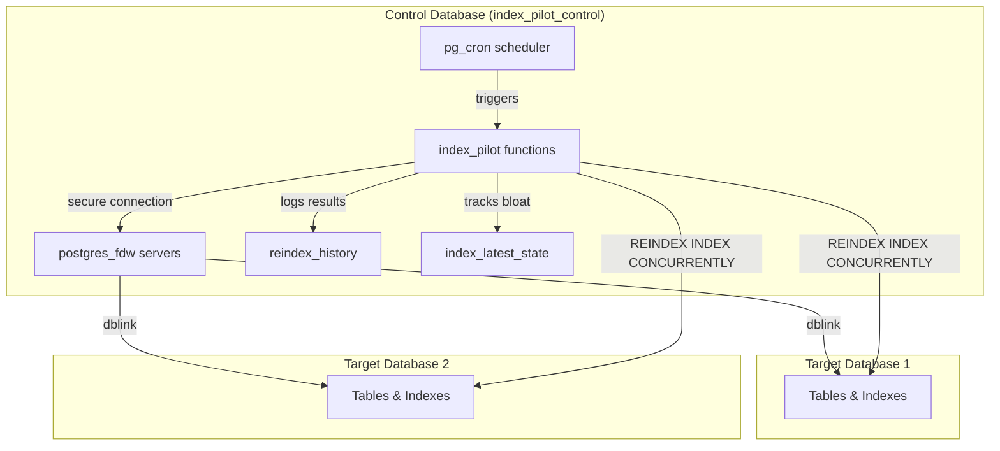

# Architecture: design decisions and how it works

## Requirements

1. **Self-contained** - Everything inside Postgres
2. **Non-blocking** - `REINDEX INDEX CONCURRENTLY` only
3. **Universal** - Works on managed services (no superuser)
4. **Secure** - No plaintext passwords
5. **Not only btree** - Support btree, GIN, GiST, HNSW and so on (BRIN currently excluded due to [Postgres bug #17205](https://www.postgresql.org/message-id/flat/17205-42b1d8f131f0cf97%40postgresql.org))

## Design decisions

### `pg_cron` for scheduling
Enables self-contained operation without external schedulers. Available on most managed services. Optional - can trigger externally if unavailable.

We support two deployment scenarios:
- If pg_cron is not yet installed: install `pg_cron` in the control database (e.g., `index_pilot_control`). This keeps scheduling self-contained in the control DB.
- If pg_cron is already installed in another database: keep it as is and schedule jobs from that database using `cron.schedule_in_database(...)` to run commands in `index_pilot_control`. Note that pg_cron may only be installed in one database per cluster; `cron.schedule_in_database` is the supported way to run jobs targeting other databases.

### `dblink` for separate connections
`REINDEX INDEX CONCURRENTLY` cannot run in transaction blocks. `dblink` creates separate connection to execute reindex operations without blocking the control session.

### `postgres_fdw` for authentication
Provides secure credential storage via user mappings. Eliminates plaintext passwords in connection strings and removes superuser requirements.

### Separate control database
Prevents deadlocks during reindex operations. Control database (`index_pilot_control`) manages all tracking while target databases remain clean without any `pg_index_pilot` installation.

## Architecture diagram



## How it works

Fire-and-forget approach:

1. Control database contains `pg_index_pilot` functions
2. `postgres_fdw` stores credentials securely
3. `dblink` executes `REINDEX INDEX CONCURRENTLY`
4. Bloat detection using Maxim Boguk's formula
5. `pg_cron` triggers periodic scans

## Compatibility

**Works:**
- Self-managed Postgres 13+
- AWS RDS/Aurora
- Google Cloud SQL
- Azure Database
- Supabase
- Any other managed Postgres or Postgres-compatible DBMS (including AWS Aurora, GCP AlloyDB) where `CREATE DATABASE`, `dblink`, and `postgres_fdw` are available

**Doesn't work:**
- TigerData, formerly Timescale Cloud (no `CREATE DATABASE`)

**Extensions:**
- `dblink` (required)
- `postgres_fdw` (required)
- `pg_cron` (optional)

## Bloat detection formula

Uses Maxim Boguk's formula (originally implemented in `pg_index_watch`) instead of traditional inaccurate bloat estimates (btree-only) or heavy `pgstattuple`-based methods (unusable in large databases):

```
bloat_indicator = index_size / pg_class.reltuples
```

**Advantages:**
- Works with any index type (btree, GIN, GiST, hash, HNSW) except BRIN (excluded due to [Postgres bug #17205](https://www.postgresql.org/message-id/flat/17205-42b1d8f131f0cf97%40postgresql.org))
- Lightweight - no expensive table scans
- Better precision for fixed-width columns
- No superuser required

**How it works:**
1. Measure baseline after `REINDEX INDEX CONCURRENTLY`
2. Monitor ratio changes over time
3. Trigger reindex when ratio exceeds threshold

**Limitations:**
- Requires initial reindex to establish baseline
- Variable-length data (`text`, `jsonb`) may cause false positives if average size changes significantly
